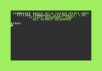

# c128
The Commodore 128.

[](img/c128-ready.png)

# Status

- Boots up to READY.
- No inputs yet so there is nothing to do.

## Run
```
retro-cs -s c128
```

## Development Notes

I thought that getting to a READY prompt would take about an hour. Implement the 128 style of banking, load the ROMs, and good to go, correct? The initialization routine is more sophisticated than the one found on the 64. 

There is supposed to be some magic with the MMU pre-configuration registers. Store a value in the PCR and when an arbitrary store happens to the corresponding load configuration register, the PCR value gets copied into the configuration register. Ignoring this for now gets to the READY prompt and I will have to visit this again. Trying to get this to work was causing problems. 

On the C64, setting the raster scan line to zero at $d012 was enough to get it to boot. On the C128, it actually looks for the 9th bit of the scan line to be set which is stored as the 7th bit in $d011. It then looks for $d012 to be greater than $8. Why that number? I have no clue. Stuffing these values before the machine starts seems to work for now. 

The emulator then hung trying to interact with the non-existent VDC chip. Since it was talking to the VDC, I assumed that it thought that the 40/80 column key was down in the 80 column position. I looked all over to see where that was being set but it turned out to not be the problem. During initialization, the 40 column *and* 80 column displays are cleared regardless of the button state.   

After implementing the minimum necessary in the VDC, the emulator booted to a monitor prompt and then filled the screen with "DSAVE". That command happens to be on one of the function keys so I suspected that it thought keyboard keys were being pressed. Filling in $dc01 with $ff gets past this for now and boots to READY. The CIA will need to be implemented this time instead of populating the keyboard buffer. 

### Memory Map Points of Interest

| Address | Description
|-|-|
| $00d7(7) | 0 = 40 column mode, 1 = 80 column mode
| $d500    | MMU configuration register
| $d505(7) | 40/80 key, 0 = 80 (down), 1 = 40 (up)
| $d600    | VDC address/status register
| $d601    | VDC data register
| $dc01    | CIA data port B

## References
- Cowper, Ottis R., "Mapping the Commodore 128", https://archive.org/details/Compute_s_Mapping_the_Commodore_128
- Greenley, Larry, et al, "Commodore 128 Programmer's Reference Guide", https://archive.org/details/C128_Programmers_Reference_Guide_1986_Bamtam_Books


