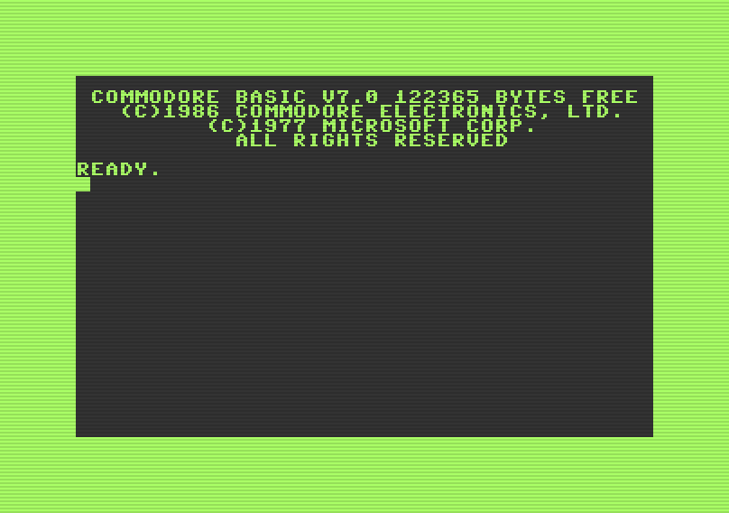

# c128
The Commodore 128.



# Status

- Boots up to READY.
- No inputs yet so there is nothing to do.

## Run
```
retro-cs -s c128
```

## Development Notes

### Memory Map Points of Interest

| Address | Description
|-|-|
| $00d7(7) | 0 = 40 column mode, 1 = 80 column mode
| $d500    | MMU configuration register
| $d505(7) | 40/80 key, 0 = 80 (down), 1 = 40 (up)
| $d600    | VDC address/status register
| $d601    | VDC data register
| $dc00    | CIA data port A
| $dc01    | CIA data port B

## References
- Cowper, Ottis R., "Mapping the Commodore 128", https://archive.org/details/Compute_s_Mapping_the_Commodore_128
- Greenley, Larry, et al, "Commodore 128 Programmer's Reference Guide", https://archive.org/details/C128_Programmers_Reference_Guide_1986_Bamtam_Books


