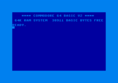
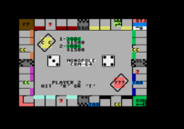
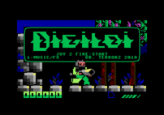
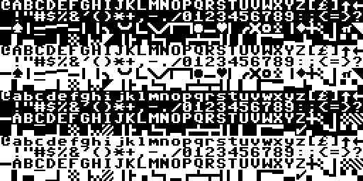

# c64
The Commodore 64.

[](img/c64-ready.png)
[](img/monopole.png)
[](img/digiloi.png)

## Status
- Only text mode
- Simple BASIC programs work
- Inputs hacked in, needs work
- No sprites
- No I/O
- No audio

## Run
```
retro-cs -s c64
```

### Controls

- `Control-C`: STOP key

## ROMs
The ROMs used from this emulator were taken from the [VICE](http://vice-emu.sourceforge.net/) source code in the `data/C64` directory. The  correct SHA1 checksums are listed below.

Place these files in `~/rcs/data/c64`
```
79015323128650c742a3694c9429aa91f355905e  basic
adc7c31e18c7c7413d54802ef2f4193da14711aa  chargen
1d503e56df85a62fee696e7618dc5b4e781df1bb  kernal
```

## Viewers
```
rcs-viewer c64:chars
rcs-viewer c64:colors
```


## Development Notes
These are my notes from the development work on the C64 emulator. For those who wish to write their own emulator, I hope that these notes are useful.

### Memory
I have some thoughts on [memory](memory.md).

The Commodore 64 uses a [banked memory scheme](https://www.c64-wiki.com/wiki/Bank_Switching) but working out the mechanics isn't necessary at this point. Configure memory to look like the default bank for now.

I assumed that if a memory had a ROM banked in that writes to that area were simply ignored. This is not correct. Writes will go to the RAM that is being hidden underneath by the ROM. I haven't encountered this so far with the Commorodre 64, but it was seen in the initializtion routine for the Commodore 128. In that case, it is copying code from ROM to RAM so that it can be accessable when the ROM is banked out. It looks weird because the code loop is reading and writing to the same address.

### CPU
See the notes on the [6502](m6502.md) series processor.

The Commodore 64 actually has a 6510 processor but the differences between the two have no impact on this software implementation.

### Tools
A full blown monitor interface is nice but here is the minimum tool set required to diagnose issues that might come up:

- Memory dumper which can show text from PETSCII and screen codes
- Disassembler
- Execution tracer that disassbles instructions as they are being executed

### First Light
Start with a main loop that endlessly executes the next CPU instruction. Load in the ROMs, start the emulator, and see if video memory is being cleared properly:

```
$0400  20 20 20 20 20 20 20 20  20 20 20 20 20 20 20 20
$0410  20 20 20 20 20 20 20 20  20 20 20 20 20 20 20 20
$0420  20 20 20 20 20 20 20 20  20 20 20 20 20 20 20 20
...
```
The emulator should be stuck in an endless loop at this location:
```
$ff5e:  ad 12 d0  lda $d012
$ff61:  d0 fb     bne $ff5e
```
This register value contains the current raster scan line and the code is waiting for this value to go to zero. Since nothing is implemented yet that changes this value, stuff this value with zero on each run loop iteration. That should be enough to get a ready prompt. The dump below shows the screen code text encoding, *not* PETSCII.

```
$0400  20 20 20 20 20 20 20 20  20 20 20 20 20 20 20 20
$0410  20 20 20 20 20 20 20 20  20 20 20 20 20 20 20 20
$0420  20 20 20 20 20 20 20 20  20 20 20 20 2a 2a 2a 2a              ****
$0430  20 03 0f 0d 0d 0f 04 0f  12 05 20 36 34 20 02 01   COMMODORE 64 BA
$0440  13 09 03 20 16 32 20 2a  2a 2a 2a 20 20 20 20 20  SIC V2 ****
$0450  20 20 20 20 20 20 20 20  20 20 20 20 20 20 20 20
$0460  20 20 20 20 20 20 20 20  20 20 20 20 20 20 20 20
$0470  20 20 20 20 20 20 20 20  20 36 34 0b 20 12 01 0d           64K RAM
$0480  20 13 19 13 14 05 0d 20  20 33 38 39 31 31 20 02   SYSTEM  38911 B
$0490  01 13 09 03 20 02 19 14  05 13 20 06 12 05 05 20  ASIC BYTES FREE
$04a0  20 20 20 20 20 20 20 20  20 20 20 20 20 20 20 20
$04b0  20 20 20 20 20 20 20 20  20 20 20 20 20 20 20 20
$04c0  20 20 20 20 20 20 20 20  12 05 01 04 19 2e 20 20          READY.
$04d0  20 20 20 20 20 20 20 20  20 20 20 20 20 20 20 20
$04e0  20 20 20 20 20 20 20 20  20 20 20 20 20 20 20 20
$04f0  20 20 20 20 20 20 20 20  20 20 20 20 20 20 20 20
```

If the system reports that 0 bytes are free, there is a bug in the `sdc` implementation.

### Video
Use the `chargen` ROM to create a tile sheet of every character:



For implementing text mode:

- Draw the border
- Draw the background
- Draw the characters

The display area, not including the border, is 320x200 pixels. With the border it is 404x284. Or it might be 403? One pixel isn't going to matter. The border color is stored at $d020 and the background color is at $d021. Text characters start at $0400 and the color for those characters is at $0800.

Enable VSync and then add the screen rendering, and an IRQ to the main run loop. The following is a good starting revision for the main loop. It can always be more detailed and flexible later.

- run 20,000 cpu instructions
- store $00 in address $d012
- render video frame
- generate IRQ
- restart loop once 16.6ms have elapsed

With video installed, the emulator should boot to the READY prompt with the familiar blue on blue color scheme with a blinking cursor. If there are problems at this point, try removing the IRQ and see if it boots properly without a cursor. If so, check for errors in the interrupt handling.

### Keyboard
The easiest way to handle the keyboard at this point is to directly store values into the keyboard buffer. When an event from the actual keyboard comes in, convert the value to PETSCII and add to the buffer found at $c6. The buffer is 10 characters long and the number of characters in the buffer is stored at $277.

Designate a key or key sequence to the STOP key. The value at address $91 is &4f when the stop key is pressed and $ff when it is released.

Start up the emulator and see if the following program works:
```basic
10 PRINT "HELLO WORLD"
20 GOTO 10
RUN
```
Use the STOP key to exit from the loop. Run the program again. If it immediately shows "BREAK", the STOP key wasn't handled properly.

### PRG load
A classic BASIC game that is great for testing is Monopole (Monopoly). No additional work is necessary to get this game running with no sound. Obtain the PRG file separately or extract it from a D64 image. The correct SHA1 checksum is as follows:

```
42dbfca950fff431c6f81dd28c1c5ce9  monopole.prg
```

The PRG file contains a two byte header that has a memory address in little-endian order. Load everything else in the file to memory starting at that address.

It is important to update two pointers after loading BASIC programs. The pointer to variable storage at $2d and the pointer to array storage $2f needs to now point to the first byte after the code that was just loaded.

Check that the program is there with:

```basic
LIST
```

and the run it:

```basic
RUN
```

If the program changes the background and border to black and then immediately crashes to a READY prompt, check that the BASIC pointers described above were updated properly.

### To Be Continued

...

### [Memory Map](http://sta.c64.org/cbm64mem.html) Points of Interest

| Address | Description
| $d012 |
| $0400 | Screen memory
| $0800 | Color memory


## References

- "Bank Switching", https://www.c64-wiki.com/wiki/Bank_Switching
- Bauer, Christian, "The MOS 6567/6569 video controller (VIC-II) and its application in the Commodore 64", http://www.zimmers.net/cbmpics/cbm/c64/vic-ii
- Butterfield, Jim, "Machine Language for the Commodore 64, 128, and Other Commodore Computers. Revised and Expanded Edition", https://archive.org/details/Machine_Language_for_the_Commodore_Revised_and_Expanded_Edition
- Davison, Lee, et al, "C64 ROM disassembly. V1.01", https://github.com/mist64/c64rom/blob/master/c64rom_en.txt
- Forster, Joe, "Commodore 64 memory map", http://sta.c64.org/cbm64mem.html
- Forster, Joe, "Commodore 64 PETSCII code to screen code conversion", http://sta.c64.org/cbm64pettoscr.html
- Leemon, Sheldon, "Mapping the Commodore 64", https://archive.org/details/Compute_s_Mapping_the_Commodore_64
- Leo, Rocco Di, "VIC-II for Beginners", https://dustlayer.com/index-vic-ii
- Turner, Rebecca, "Unicode-PETSCII", https://github.com/9999years/Unicode-PETSCII
- "The Versatile Commodore Emulator", http://vice-emu.sourceforge.net/
