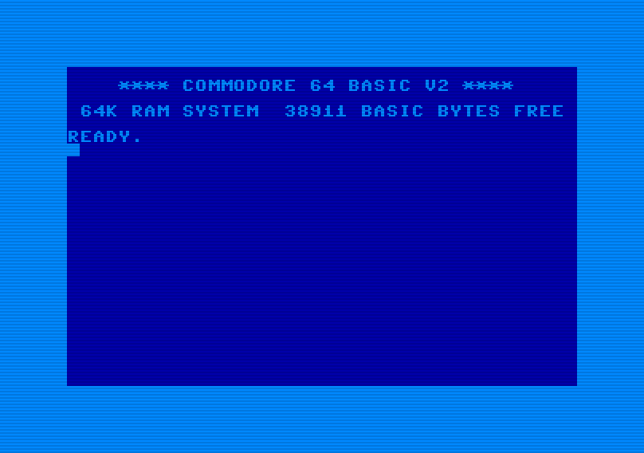

# c64
The Commodore 64.



## Status
- Only text mode
- Simple BASIC programs work
- Inputs hacked in, needs work
- No sprites
- No I/O
- No audio

## Known Programs
- monopole seems to work
- digiloi seems to work
- laser chess shows intro screen then crashes, probably unsupported video mode

## Run
```
retro-cs -s c64
```

### Controls

- `Control-C`: STOP key

## ROMs
The ROMs used from this emulator were taken from the [VICE](http://vice-emu.sourceforge.net/) source code in the `data/C64` directory. The  correct SHA1 checksums are listed below.

Place these files in `~/rcs/data/c64`
```
79015323128650c742a3694c9429aa91f355905e  basic
adc7c31e18c7c7413d54802ef2f4193da14711aa  chargen
1d503e56df85a62fee696e7618dc5b4e781df1bb  kernal
```

## Viewers
```
rcs-viewer c64:chars
rcs-viewer c64:colors
```

## References

- "Bank Switching", https://www.c64-wiki.com/wiki/Bank_Switching
- Bauer, Christian, "The MOS 6567/6569 video controller (VIC-II) and its application in the Commodore 64", http://www.zimmers.net/cbmpics/cbm/c64/vic-ii
- Butterfield, Jim, "Machine Language for the Commodore 64, 128, and Other Commodore Computers. Revised and Expanded Edition", https://archive.org/details/Machine_Language_for_the_Commodore_Revised_and_Expanded_Edition
- Davison, Lee, et al, "C64 ROM disassembly. V1.01", https://github.com/mist64/c64rom/blob/master/c64rom_en.txt
- Forster, Joe, "Commodore 64 memory map", http://sta.c64.org/cbm64mem.html
- Forster, Joe, "Commodore 64 PETSCII code to screen code conversion", http://sta.c64.org/cbm64pettoscr.html
- Leemon, Sheldon, "Mapping the Commodore 64", https://archive.org/details/Compute_s_Mapping_the_Commodore_64
- Leo, Rocco Di, "VIC-II for Beginners", https://dustlayer.com/index-vic-ii
- Turner, Rebecca, "Unicode-PETSCII", https://github.com/9999years/Unicode-PETSCII
- "The Versatile Commodore Emulator", http://vice-emu.sourceforge.net/
